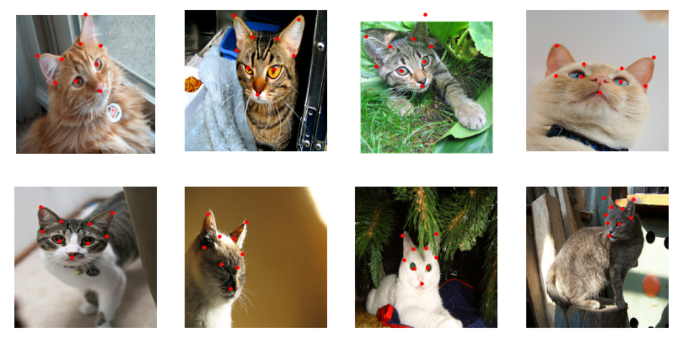

# Cat Facial Landmark Detection

Predicting 9 facial landmarks (18 coordinates) on cat images using transfer learning, comparing MobileNetV2 and EfficientNetB3.

## Overview

This project detects facial features on cats — eyes, mouth, and ears — using a dataset of roughly 10,000 images, each paired with a landmark coordinate file. Two backbones (MobileNetV2 and EfficientNetB3) are fitted using transfer learning and fine tuning as well as custom Wing Loss for the loss function.



## Dataset

- ~10,000 cat images
- Each image paired with a coordinate file containing 18 numbers (9 landmarks × x,y)
- Landmarks cover: eyes, mouth, ears

## Approach

- **Backbones:** MobileNetV2 and EfficientNetB3 (both pretrained on ImageNet)
- **Head:** Custom regression head for landmark coordinate prediction
- **Data augmentation:** Random rotation
- **Training strategy:** Two-phase fine-tuning
  1. Frozen backbone, train regression head only
  2. Unfreeze and fine-tune with a lower learning rate
- **Loss:** Wing Loss (Feng et al., 2018), replacing the standard MAE loss used in earlier versions of this project

## Results Analysis

| Model | MAE | MSE | RMSE | R2 | Size(MB)| Inference Time per Sample(ms)|
|---|---|---|---|---|---|---|
| MobileNetV2 | 0.0160 | 0.0008 | 0.0279 | 0.9519 | **27.1273** | **20.8915** |
| EfficientNetB3 | **0.0142** | **0.0005** | **0.0223** | **0.9688** | 122.5796 | 42.1580 |

**MAE** — Average of \|predicted - actual\|. Every error contributes proportionally to its size. The metric used when comparing models on the performance log.

**MSE** — Average of (predicted - actual)². Large errors get penalized disproportionally more than smaller ones. When using numbers between 0 and 1, you need to be careful since the values can get very small — the relative penalty for large errors still holds, but the numbers themselves become less numerically well-scaled for training compared to using MSE on larger-magnitude data.

**RMSE** — Just sqrt(MSE). Brings the units back to the original scale while keeping MSE's property of penalizing large errors more heavily. Watch the gap between RMSE and MAE — if RMSE is much larger, there may be large outlier errors dragging it up (less noticeable with values between 0 and 1, for the same reason noted above).

**R²** — R² = 1 means perfect predictions. R² = 0 means the model predicts the average (as accurate as always predicting the mean landmark position). R² < 0 means the model does worse than simply predicting the mean.

## Conclusion

This project has been about detecting facial features for cats, using a dataset with roughly 10,000 images. Each image contained a corresponding file with the landmark coordinates — 18 numbers representing 9 landmarks for the eyes, mouth, and ears.

Adding rotation augmentation and switching to Wing Loss improved MobileNetV2's results over the earlier baseline (MAE dropped from 0.0167 to 0.0160, R² rose from 0.9486 to 0.9519). EfficientNetB3 pushed accuracy further, reaching an MAE of 0.0142 and R² of 0.9688, at the cost of a much larger model (122.58MB vs 27.13MB) and roughly double the inference time (42.16ms vs 20.89ms).

> **Note:** MobileNetV2 remains the better choice when speed and size matter — it's roughly 4.5x smaller and 2x faster than EfficientNetB3. If accuracy is the priority and resource constraints are looser, EfficientNetB3 gives noticeably better results.

## Future Work

- Explore additional data augmentation strategies (flipping, color jitter, scaling)
- Compare heavier backbones (e.g. ResNet50) where speed/size is less of a constraint
- Tune Wing Loss hyperparameters further

## Project Structure

```
├── My_Images
├── cat-landmarks-detection.ipynb
├── cat_landmarks_predictions.png
└── README.md
```

## How to Run

```bash
# Clone the repo
git clone https://github.com/BenLubetzky/Cat_Landmarks_Detection.git
cd Cat_Landmarks_Detection
```

## Acknowledgments / References

This project makes use of the following resources:

- **MobileNetV2** — pretrained on ImageNet, used via `tf.keras.applications`.
  Sandler, M., Howard, A., Zhu, M., Zhmoginov, A., & Chen, L.-C. (2018). *MobileNetV2: Inverted Residuals and Linear Bottlenecks.* CVPR. [arXiv:1801.04381](https://arxiv.org/abs/1801.04381)

- **EfficientNetB3** — pretrained on ImageNet, used via `tf.keras.applications`.
  Tan, M., & Le, Q. V. (2019). *EfficientNet: Rethinking Model Scaling for Convolutional Neural Networks.* ICML. [arXiv:1905.11946](https://arxiv.org/abs/1905.11946)

- **Wing Loss** — implemented from scratch based on the formulation described in:
  Feng, Z.-H., Kittler, J., Awais, M., Huber, P., & Wu, X. (2018). *Wing Loss for Robust Facial Landmark Localisation with Convolutional Neural Networks.* CVPR. [arXiv:1711.06753](https://arxiv.org/abs/1711.06753)